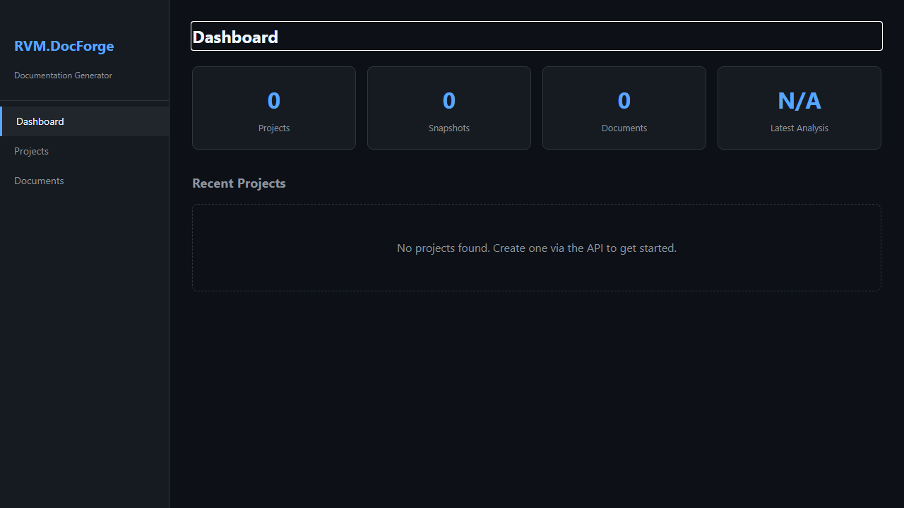
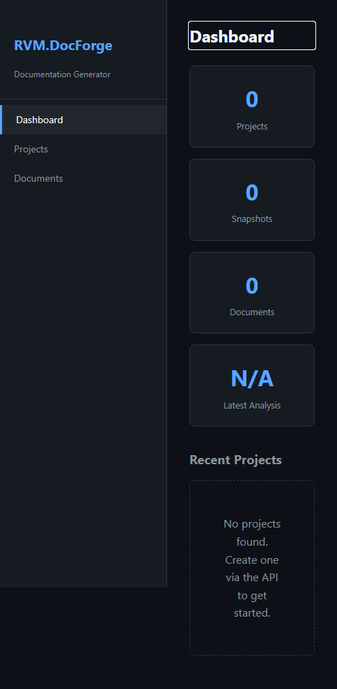
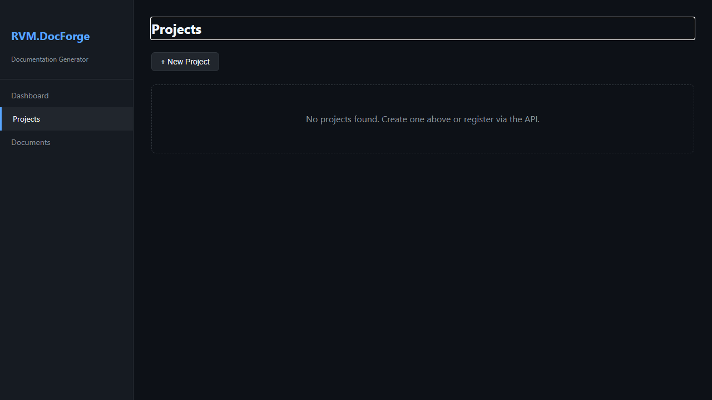
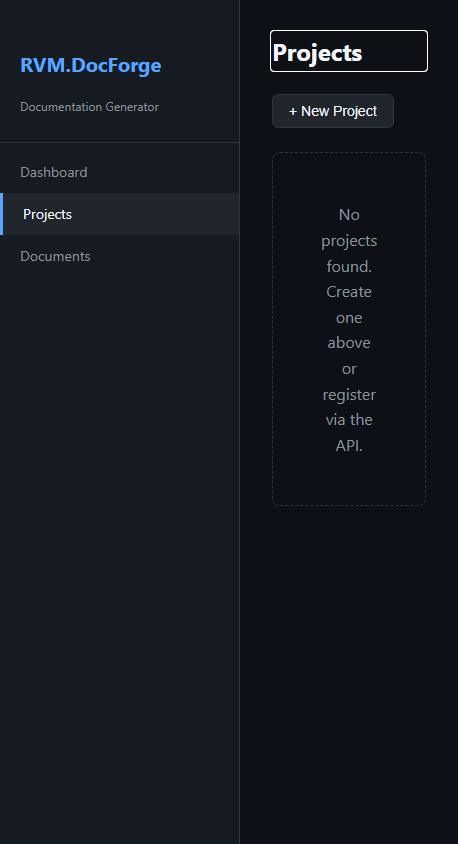
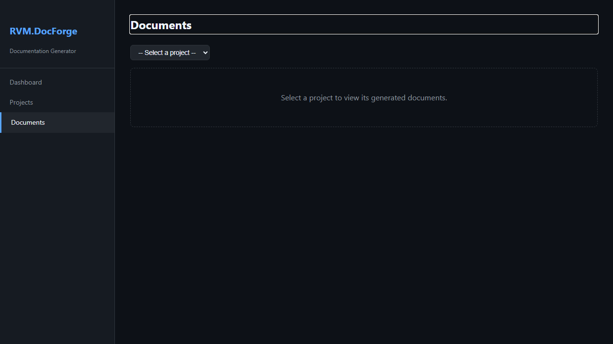
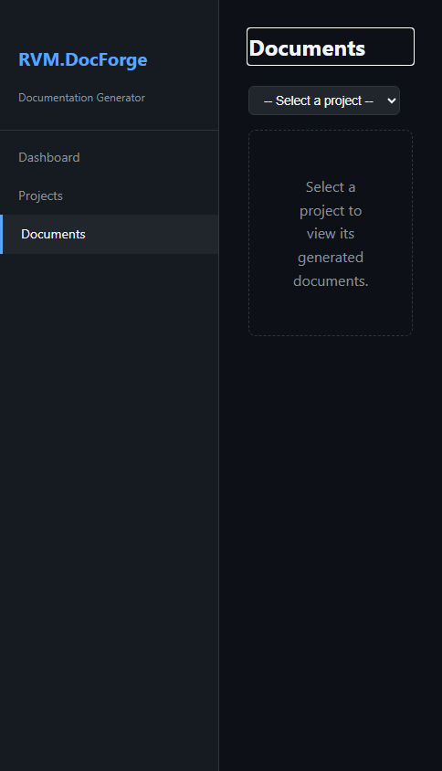

# RVM.DocForge - Manual do Usuario

> Documentacao Automatica via Roslyn — Guia Completo de Funcionalidades
>
> Gerado em 26/04/2026 | RVM Tech

---

## Visao Geral

O **RVM.DocForge** gera documentacao automatica para projetos .NET em 7 formatos usando Roslyn.

**Recursos principais:**
- **Analise Roslyn** — extrai tipos, metodos, propriedades e XML docs
- **7 formatos de saida** — Markdown, HTML, PDF, Word, JSON, XML, OpenAPI
- **Geracao automatica** — integra com Git para regenerar em cada commit
- **Cobertura de docs** — relatorio de membros sem documentacao

---

## 1. Dashboard Principal

Painel central do RVM.DocForge. Exibe estatisticas globais da documentacao gerada: projetos cadastrados, documentos produzidos e atividade recente.

**Funcionalidades:**
- Contagem de projetos e documentos gerados
- Atividade recente de geracao de documentacao
- Atalhos rapidos para projetos e documentos
- Status do motor de analise Roslyn

| Desktop | Mobile |
|---------|--------|
|  |  |

---

## 2. Projetos

Gerenciamento de projetos .NET monitorados pelo DocForge. Cada projeto representa um repositorio ou solucao que sera documentada automaticamente.

**Funcionalidades:**
- Listagem de projetos cadastrados
- Adicionar novo projeto (URL Git ou caminho local)
- Status de documentacao por projeto (atualizado/desatualizado)
- Acesso rapido para gerar ou visualizar documentacao
- Remocao de projetos

> **Dicas:**
> - Vincule o projeto ao repositorio Git para rastrear mudancas automaticamente.
> - O DocForge monitora commits e regenera a documentacao quando detecta alteracoes no codigo.

| Desktop | Mobile |
|---------|--------|
|  |  |

---

## 3. Documentos

Biblioteca de documentos gerados automaticamente via analise Roslyn. Suporta 7 formatos de saida: Markdown, HTML, PDF, Word, JSON, XML e OpenAPI.

**Funcionalidades:**
- Listagem de todos os documentos gerados
- Filtro por projeto, formato e data de geracao
- Preview inline do documento
- Download em multiplos formatos
- Historico de versoes por documento

> **Dicas:**
> - Use o formato OpenAPI para gerar especificacoes que podem ser importadas no Postman ou Swagger UI.
> - O formato HTML inclui navegacao lateral e busca full-text.

| Desktop | Mobile |
|---------|--------|
|  |  |

---

## 4. Geracao de Documentacao

Interface para acionar manualmente a geracao de documentacao de um projeto. Permite selecionar o projeto, formato de saida e opcoes de configuracao.

**Funcionalidades:**
- Selecao de projeto e formato de saida
- Opcoes: incluir exemplos, metodos privados, XML docs
- Progresso de geracao em tempo real
- Preview do documento gerado
- Download imediato apos conclusao

| Desktop | Mobile |
|---------|--------|
|  |  |

---

## 5. Analise de Codigo

Relatorio de cobertura de documentacao: quais tipos, metodos e propriedades possuem XML docs e quais estao sem documentacao.

**Funcionalidades:**
- Percentual de cobertura de documentacao por assembly
- Lista de membros sem XML doc comments
- Sugestoes automaticas de documentacao via IA
- Exportacao do relatorio de cobertura
- Comparacao entre versoes

> **Dicas:**
> - Mire em pelo menos 80% de cobertura de documentacao para APIs publicas.
> - Use as sugestoes de IA como ponto de partida — revise sempre antes de publicar.

| Desktop | Mobile |
|---------|--------|
|  |  |

---

## Informacoes Tecnicas

| Item | Detalhe |
|------|---------|
| **Tecnologia** | ASP.NET Core + Blazor Server |
| **Motor de analise** | Microsoft Roslyn + MSBuild Workspace |
| **Formatos de saida** | Markdown, HTML, PDF, Word, JSON, XML, OpenAPI |
| **Banco de dados** | PostgreSQL 16 |

---

*Documento gerado automaticamente com Playwright + TypeScript — RVM Tech*
